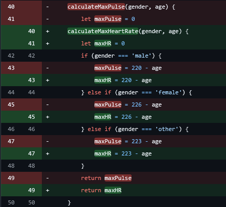
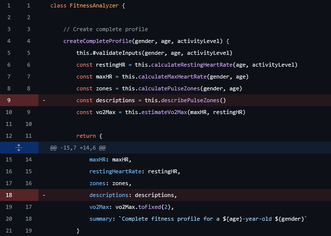
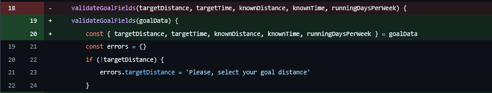
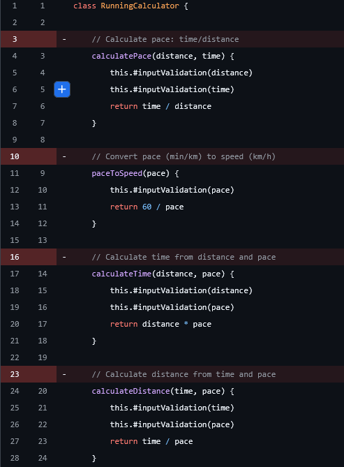
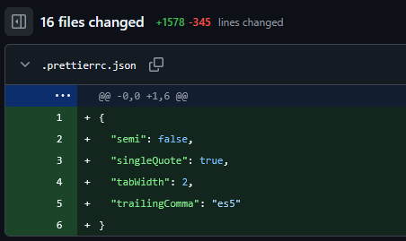
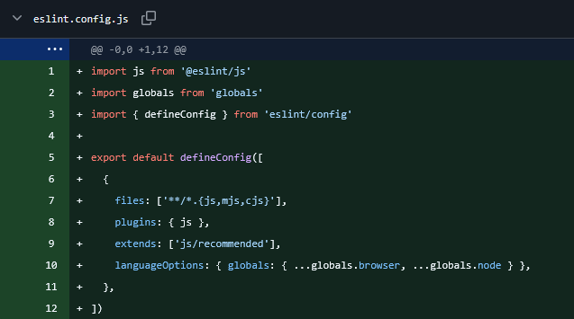
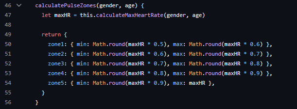
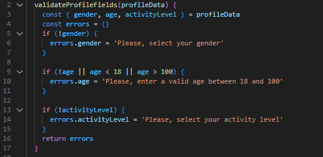
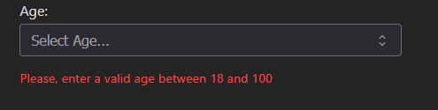
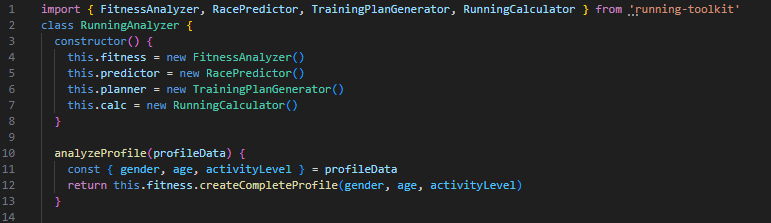

# Reflection

Gå igenom all kod inklusive kod från laboration 2 (OBS!: Separat branch från den ni lämnat in i laboration 2) och uppdatera enligt bokens clean code kapitel 2-11 och det vi diskuterat på föreläsningar och workshops. Skriv en kort (4-6 meningar) reflektion för varje kapitel om hur just det kapitlet har påverkat eller inte påverkat din kod. Använd bokens termer. Ge exempel med läsbara screenshots från er kod till varje reflektion. Dokumentera detta till mig i ett separat dokument reflection.md där jag är mottagaren.

Fokusera på tydlighet, variation, ärlighet och vad som är intressant. Exempelvis om du har icke självklara överväganden med olika kvalitetsregler som står i konflikt med varandra så är dessa extra intressanta.

## Kapitel 2

### L2

Jag har nu gått igenom koden och ändrat om namnet på metoden `calculateMaxPulse()` till `calculateMaxHeartRate()` för att vara konsekvent (**Be Consistent**) med andra liknande metoder som exempelvis `calculateRestingHeartRate()`.

### L3

I starten av L3-appen har jag varit noga med att hålla namngivningen konsekvent på mina komponenter (Profile, Goal och Results). Jag kommer även att vara uppmärksam på kommande implementering och överväga namn noga.

## Kapitel 3

### L2

Som nämnt tidigare i L2 reflektionen blev metoden `describePulseZones()` inte optimal eftersom den returnerade hårdkodade beskrivningar. Lösningen blev att ta bort den ifrån `createCompleteProfile()` vilket följer **Separation of Concerns**. Jag tycker att detta blev en bra kompromiss där jag behåller beskrivningarna och låter användaren själv kan bestämma om standardbeskrivningarna ska användas eller inte.

### L3

Jag är nöjd med hur jag har strukturerart appen utifrån kapitel 3. Komponenterna är tydligt separerade och egna tydliga ansvar. Jag har även service/hjälp-klasser som hjälper till att separera logik från presentation, vilket följer **Single Responsibility Principle** och **Do One Thing**. Jag har även refaktorerat på några ställen där det blev många parametrar för att följa **Functional Arguments**.

## Kapitel 4

Clean Code är överlag negativt inställd till kommentarer och anser att de är överflödiga och onödiga i de flesta fallen. Jag håller med om att det lätt kan bli en kommentar som bara upprepar exempelvis en metods namn. Jag har själv gjort detta och kommer refaktorera det. Ett exempel från min kod:
// calculates pace
`calculatePace()`
Jag kan dock tycka att kommentarer fyller en funktion som inte tas upp i kapitlet. Vilket är att det kan ge en naturlig avskiljare i koden. För mig personligen där jag är i min utveckling så ökar det readability men jag kan förstå att det är onödigt och som boken nämner att whitespaces, blank lines ska täcka detta.

### L2

Efter att ha gått igenom mina kommentarer i L2 insåg jag att det bara var **Redundant Comments** och inte en enda kommentar uppfyllde något syfte, vilket resulterade i att jag tog bort alla. Jag tycker att jag följer principen om **Self-documenting Code** på ett bra sätt. En kommentar som jag hela tiden tyckt varit användbar där jag beskrev vilken formel som användes för en uträkning insåg jag att även den var överflödig eftersom jag förklarar det i min readme.

### L3

Jag har fokuserat mycket på **Self-documenting Code** och övervägt noga under appens utveckling om kommentarer behövs eller inte. Resultatet har är tydligt eftersom jag inte har några kommentarer alls.

## Kapitel 5

Detta kapitel handlar om formattering och hur det påverkar läsbarheten i koden. Jag har inte lagt så mycket vikt vid detta tidigare och mer kört på känsla om vad som ser bra eller snyggt ut. Jag har tidigare använt ESLint eller Checkstyle med färdig config från skolan. Efter att ha läst detta kapitel inser jag vikten av att ha kensekventa regler för saker som white space mellan funktioner, indentering och fillängd.

### L2

Jag har nu installerat både ESLint och Prettier för min modul. **ESLint** för att hitta eventuella kodkvalitetsproblem och buggar. **Prettier** används för att formatera koden. När jag körde Prettier formaterades 16 filer automatiskt enligt de regler jag satt upp (2 spaces indentation, single quotes, no semicolons). Detta följer Clean Codes principer om **Vertical Formatting** och **Horizontal Formatting**. Jag upptäckte efteråt att rad-längden hade standardinställning på 80 tecken, denna har jag nu uppdaterat med `"printWidth": 110` för bättre readability av koden.

### L3

För L3 har jag detta installerat (ESLint kom automatiskt med installationen av Vite/React) och Prettier har jag installerat med samma inställningar som L2. Detta känns väldigt skönt att jag inte kommer behöva tänka på dessa regler utan kan enkelt formatera koden för att applicera reglerna. 

## Kapitel 6

Detta kapitel handlade om skillnaden mellan datastrukturer som exponerar data och objekt som exponerar beteende. Detta kapitel tycker jag var utmanande att greppa eftersom JavaScript använder objekt-syntax för både datastrukturer och riktiga objekt, vilket gör det ganska rörigt för mig.

### L2

Min modul följer principen om **Data/Object Anti-Symmetry**. Klasserna fungerar som objekt som döljer implementationen, medan alla returvärden är rena datastrukturer (nummer, strängar eller objekt med data). Till exempel returnerar `calculatePulseZones()` ett objekt med zoner som bara innehåller data, utan några metoder. Jag tycker denna design fungerar bra för min modul.

### L3

I L3 följer jag samma princip. Logiken ligger i separata klasser och endast data skickas mellan komponenterna.

## Kapitel 7

Detta kapitel belyser vikten av god error handling. I min modul använder jag **Exceptions** (throw new error()) för inputvalidering, vilket fungerar bra och är rätt enligt kapitlet. Användaren får tydliga felmeddelanden och kan hantera fel med try-catch i sin egna kod. Jag använder privata valideringsmetoder vilket går hand i hand med DRY och separation of concerns.

### L2

Min error hantering fick positiv feedback, så jag väljer att inte göra några förändringar och behåller strukturen som den är.

### L3

I L3 hanterar jag möjliga fel genom `ValidationService` som returnerar ett error-objekt istället för att kasta undantag. Felmeddelanden visas direkt och tydligt för användaren och är mer naturligt för en app.

`{errors.age && {errors.age}}`

## Kapitel 8

Detta kapitel handlar om att hantera gränser mellan kod och externa beroenden. Eftersom min modul inte har några externa beroenden var detta svårt att applicera direkt. Jag förstår konceptet med att "wrappa" tredjepartskod i egna klasser för att minska beroenden, men utan praktisk erfarenhet av det är det svårt att fullt ut greppa. Det är något jag tar med mig till framtida projekt, speciellt L3 där jag kommer använda mig av beroenden.

### L2

Inga förändringar då modulen inte har några externa beroenden.

### L3

I L3 har jag ramverket React och min modul running-toolkit som externa beroenden. `RunningAnalyzer`-klassen fungerar som en adapter/wrapper till modulen där jag använder modulens metoder och skapar därmed en tydlig gräns vart modulens metoder används. Komponenterna kan sedan skapa instanser av `RunningAnalyzer` istället för att använda modulen direkt. 

## Kapitel 9

Detta kapitel handlar om hur man skriver rena, tydliga och tillförlitliga tester. Kapitlet betonar att tester är lika viktiga som produktionskod och att dåliga tester gör att kodbasen förlorar flexibilitet medan rena och välstrukturerade tester gör det mer robust och möjlighet att refaktorera system enklare. Viktiga principer jag tar med mig är **One Assert Per Test** och **Single Concept Per Test** för att hålla tester rena och läsbara.

### L2

Mina nuvarande manuella tester fungerar bra men följer inte **F.I.R.S.T**-principerna fullt ut. Jag väljer dock att behålla dem som de är i modulen.
Jag kommer implementera Jest i mån av tid. 

### L3

Här har jag använt manuella tester genom användargränssnittet som täcker både funktionella och icke-funktionella krav från [Kravspecifikationen](requirements.md).
Det finns även en [Testrapport](testreport.md) med resultaten.

## Kapitel 10

### L2

**Classes Should Be Small!**

### L3

